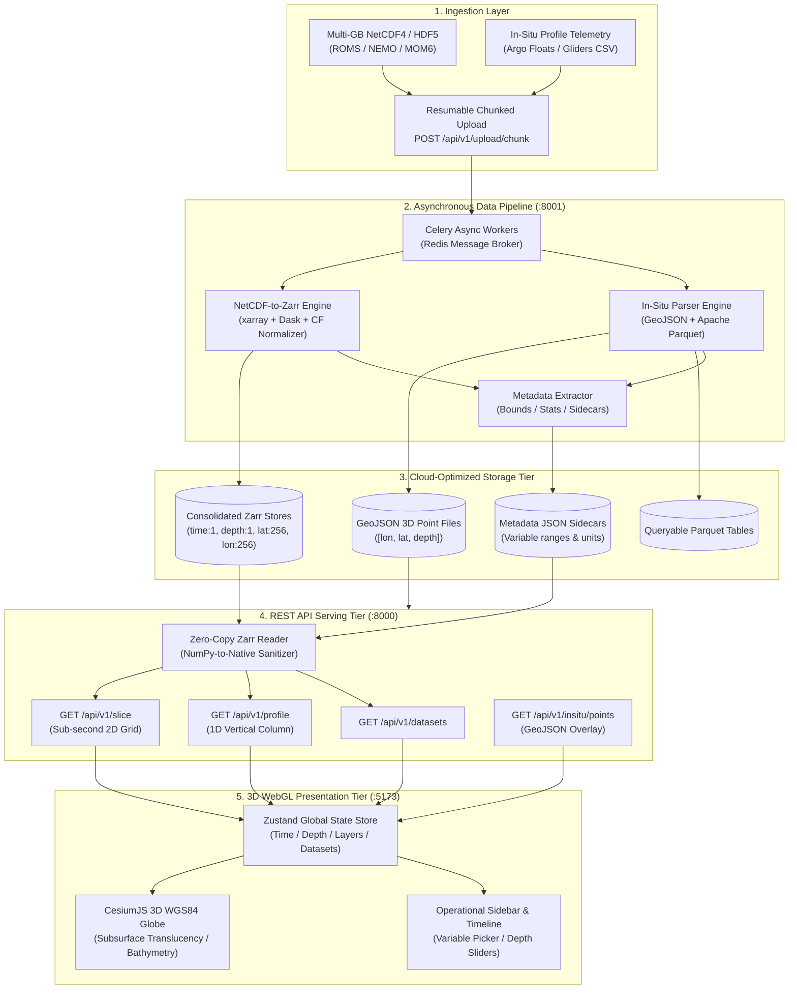

# INCOIS 3D Ocean Data Visualization & Ingestion Pipeline System

<div align="center">

[](https://www.sih.gov.in/)
[](https://moes.gov.in/)
[](https://incois.gov.in/)
[](https://www.python.org/)
[](https://fastapi.tiangolo.com/)
[](https://cesium.com/)
[](https://react.dev/)
[](https://www.docker.com/)
[](https://docs.pytest.org/)

<br />

**A mission-critical, browser-native 3D oceanographic visualization and cloud-optimized data ingestion pipeline developed for the Indian National Centre for Ocean Information Services (INCOIS, Ministry of Earth Sciences, Govt. of India).**

[Explore Architecture](#-system-architecture) • [Key Features](#-core-capabilities) • [API Specification](#-rest-api-specifications) • [Quick Start](#-quick-start--installation) • [Docker Deployment](#-docker-orchestration) • [Testing](#-automated-testing--verification)

</div>

---

## 🌊 Executive Summary & Problem Statement

Oceanographic institutions like **INCOIS** continuously generate and assimilate terabytes of multi-dimensional numerical ocean models (e.g., ROMS, NEMO, MOM6) alongside real-time telemetry from autonomous observing platforms (Argo profiling floats, deep-sea gliders, moored buoys, and HF radars). 

Traditional workflows suffer from severe data fragmentation: forecasters, coast guards, and marine scientists must navigate disconnected 2D slice viewers, desktop GIS applications, and static charts.

The **INCOIS 3D Ocean Data Visualization System** resolves these challenges by providing:
1. **Asynchronous Ingestion Engine:** High-performance, zero-RAM-exhaustion conversion of multi-gigabyte NetCDF4/HDF5 models into cloud-optimized, chunked **Zarr stores**.
2. **In-Situ Ingestion Pipeline:** Automated parsing and spatial indexing of CSV/ASCII Argo and glider trajectories into validated **3D GeoJSON FeatureCollections** and queryable **Apache Parquet** tables.
3. **Sub-Second Slice & Profile APIs:** FastAPI-powered REST services serving 2D lat-lon spatial slices (<150ms) and 1D water-column vertical profiles on demand.
4. **4D WebGL Geospatial Globe:** A GPU-accelerated CesiumJS workspace featuring bathymetric terrain, solar lighting, subsurface globe translucency, dynamic multi-stop colormaps, interactive timeline simulation, and double-click vertical profile extraction.

---

## ✨ Core Capabilities

### 1. High-Performance Array Storage & Processing Tier
- **Zero-RAM Exhaustion:** Multi-gigabyte NetCDF models are evaluated lazily via `xarray` + `Dask` without loading raw arrays into memory.
- **Optimized Zarr Chunking Schema:** Gridded datasets are consolidated and chunked along `(time: 1, depth: 1, lat: 256, lon: 256)` for instant spatial slice queries.
- **CF Conventions Normalization:** Automatic alias detection and coordinate standardization across divergent modeling conventions (`LONGITUDE`/`lon_rho` → `lon`, `LATITUDE`/`lat_rho` → `lat`, `DEPTH`/`nav_lev` → `depth`, `TIME`/`time_counter` → `time`).
- **Data Integrity & Sanitization:** Strict NaN/Inf sanitization to JSON-compliant `null` values with complete NumPy dtype conversion.

### 2. Autonomous Instrument & In-Situ Pipeline
- **Multi-Format Ingestion:** Ingests Argo float profiles, CTD casts, and glider missions from CSV/TXT/TSV formats with resilient column auto-detection.
- **Dual Output Strategy:** Generates RFC 7946 3D GeoJSON (`[lon, lat, depth]`) for globe overlays and columnar Parquet tables for analytical queries.
- **Dynamic Metadata Sidecars:** Extracts and caches spatial bounding boxes, vertical depth levels, parameter units, and min/max/mean statistics for dynamic colorbar scaling.

### 3. 3D WebGL Operational Workspace (Frontend)
- **CesiumJS Digital Earth:** True WGS84 (EPSG:4326) globe visualization with real-world bathymetric terrain (`createWorldTerrainAsync`) and subsurface globe translucency.
- **Subsurface Depth Exaggeration:** Interactive $1.0\times - 10.0\times$ depth exaggeration slider mapping negative ocean depths below the ellipsoid.
- **Interactive Depth Profiling:** Double-click anywhere on the ocean surface to trigger a live vertical water-column profile (`GET /api/v1/profile`).
- **Dynamic Colorbar Legend:** 5-stop smooth color ramp (Deep Blue → Cyan → Green → Yellow → Red) dynamically scaled against real-time variable statistics (`min`, `max`, `mean`).
- **Multi-Layer Co-Visualization:** Simultaneous toggling of Sea Surface Temperature (SST) heatmaps, salinity fields, Argo float trajectories, and underwater gliders.

---

## 🏛️ System Architecture



---

## 📁 Repository Directory Structure

```text
incois-3d-ocean-viz/
├── backend/                       # REST API Service (FastAPI)
│   ├── app/
│   │   ├── api/v1/                # Versioned API route handlers
│   │   │   ├── upload.py          # Resumable chunked file upload & checksum verification
│   │   │   ├── datasets.py        # Metadata catalog and dataset discovery
│   │   │   ├── slice.py           # Sub-second 2D lat-lon array slicing from Zarr
│   │   │   ├── profile.py         # 1D vertical water-column profile extraction
│   │   │   └── insitu.py          # 3D GeoJSON in-situ observations endpoint
│   │   ├── core/
│   │   │   └── config.py          # Centralized Pydantic v2 settings & paths
│   │   ├── schemas/
│   │   │   └── ocean.py           # Strict Pydantic v2 schemas (NaN-safe models)
│   │   ├── storage/
│   │   │   └── zarr_reader.py     # High-performance, zero-copy Zarr slice reader
│   │   └── main.py                # FastAPI factory, CORS middleware, lifecycle hooks
│   ├── data/                      # Shared persistent volume for processed datasets
│   │   ├── zarr_stores/           # Consolidated .zarr directory stores
│   │   ├── geojson/               # In-situ GeoJSON FeatureCollections
│   │   ├── parquet/               # Queryable Apache Parquet tables
│   │   ├── metadata/              # Dataset metadata JSON sidecars
│   │   └── uploads/               # Chunked upload assembly directory
│   ├── Dockerfile                 # Backend container definition
│   └── requirements.txt           # Backend Python dependencies
│
├── data-pipeline/                 # Asynchronous Processing Engine (Celery + xarray)
│   ├── pipeline/
│   │   ├── core/
│   │   │   ├── config.py          # Pipeline configuration & CF alias maps
│   │   │   └── celery_app.py      # Celery application & worker configuration
│   │   ├── parsers/
│   │   │   ├── base.py            # AbstractOceanParser base class for plugin extensibility
│   │   │   ├── netcdf_parser.py   # Lazy xarray + Dask + NetCDF-to-Zarr converter
│   │   │   └── in_situ_parser.py  # CSV/TXT to GeoJSON & Parquet parser
│   │   ├── metadata_extractor.py  # Cache builder for spatial bounds, ranges & statistics
│   │   ├── tasks.py               # Celery async ingestion tasks & sync fallback
│   │   └── main.py                # Lightweight pipeline HTTP trigger service (:8001)
│   ├── Dockerfile                 # Pipeline worker container definition
│   └── requirements.txt           # Pipeline Python dependencies
│
├── frontend/                      # 3D WebGL Client (React + CesiumJS)
│   ├── src/
│   │   ├── components/
│   │   │   ├── MapCanvas.jsx      # CesiumJS 3D viewer, entity rendering, colormaps, click events
│   │   │   ├── Sidebar.jsx        # Operational controls, dataset picker, depth & variable sliders
│   │   │   └── ProtectedRoute.jsx # Route authentication guard
│   │   ├── context/
│   │   │   └── AuthContext.jsx    # Session & user role management
│   │   ├── layouts/
│   │   │   └── DashboardLayout.jsx# Responsive 3D layout container
│   │   ├── pages/
│   │   │   ├── LandingPage.jsx    # Presentation landing page
│   │   │   └── LoginPage.jsx      # Authentication portal for forecasters & analysts
│   │   ├── store/
│   │   │   └── useMapStore.js     # Zustand state manager & asynchronous API fetch actions
│   │   ├── App.jsx                # React router entrypoint
│   │   ├── main.jsx               # Application bootstrap
│   │   └── index.css              # Global styles & Tailwind CSS tokens
│   ├── package.json               # Node.js dependencies & scripts
│   └── vite.config.js             # Vite configuration with Cesium plugin integration
│
├── tests/                         # Verification & Automated Test Suite
│   ├── generate_mock_ocean_data.py# 4D NetCDF ocean model & Argo CSV trajectory generator
│   ├── test_pipeline.py           # Pipeline unit & integration tests (Zarr, latency, CF aliases)
│   ├── test_api.py                # REST API endpoint tests (FastAPI TestClient)
│   └── conftest.py                # Pytest path and fixture configurations
│
├── docker-compose.yml             # Full-stack Docker orchestration (Redis, API, Pipeline, Worker)
└── README.MD                      # System documentation
```

---

## 📡 REST API Specifications

The Backend API provides sub-second REST endpoints designed for low-latency frontend canvas texture mapping and vertical profile plotting:

### 1. `GET /api/v1/datasets`
Returns the catalog of all available processed ocean models and in-situ observation datasets.

<details>
<summary><b>Sample Response (200 OK)</b></summary>

```json
{
  "datasets": [
    {
      "dataset_id": "incois_ocean_model",
      "name": "Incois Ocean Model",
      "type": "gridded",
      "variables": ["temperature", "salinity"],
      "depth_levels": [0.0, -10.0, -50.0, -100.0, -200.0, -500.0, -800.0, -1000.0, -1500.0, -2000.0],
      "time_steps": 24,
      "time_range": {
        "start": "0",
        "end": "23"
      },
      "bounds": {
        "lat_min": 5.0,
        "lat_max": 25.0,
        "lon_min": 65.0,
        "lon_max": 85.0
      },
      "units": {
        "temperature": "°C",
        "salinity": "PSU"
      }
    }
  ]
}
```
</details>

---

### 2. `GET /api/v1/slice`
Extracts a normalized 2D lat-lon spatial slice from a Zarr store at the specified depth level and forecast time index.

**Parameters:**
- `dataset_id` (string, required): e.g., `incois_ocean_model`
- `variable` (string, required): `temperature` or `salinity`
- `depth_idx` (int, default: `0`): Depth layer index ($0 = \text{Surface}$)
- `time_idx` (int, default: `0`): Temporal index

<details>
<summary><b>Sample Response (200 OK)</b></summary>

```json
{
  "dataset_id": "incois_ocean_model",
  "variable": "temperature",
  "depth_idx": 0,
  "time_idx": 0,
  "lat": [5.0, 5.317, 5.635, "..."],
  "lon": [65.0, 65.317, 65.635, "..."],
  "values": [
    [28.12, 28.34, 28.56, "..."],
    [28.05, 28.22, 28.48, "..."]
  ],
  "stats": {
    "min": 25.12,
    "max": 31.45,
    "mean": 28.37
  },
  "units": "°C"
}
```
</details>

---

### 3. `GET /api/v1/profile`
Extracts a 1D vertical water-column profile across all depth layers at the grid point closest to the specified coordinates.

**Parameters:**
- `dataset_id` (string, required): e.g., `incois_ocean_model`
- `variable` (string, required): `temperature`
- `lat` (float, required): Latitude (e.g., `15.0`)
- `lon` (float, required): Longitude (e.g., `72.5`)
- `time_idx` (int, default: `0`): Temporal index

<details>
<summary><b>Sample Response (200 OK)</b></summary>

```json
{
  "dataset_id": "incois_ocean_model",
  "variable": "temperature",
  "lat": 15.15,
  "lon": 72.61,
  "time_idx": 0,
  "depths": [0.0, -10.0, -50.0, -100.0, -200.0, -500.0, -800.0, -1000.0, -1500.0, -2000.0],
  "values": [28.94, 28.41, 26.12, 23.05, 18.72, 10.45, 6.12, 4.31, 3.10, 2.15],
  "units": "°C"
}
```
</details>

---

### 4. `GET /api/v1/insitu/points`
Returns all 3D observation points as a validated GeoJSON FeatureCollection.

<details>
<summary><b>Sample Response (200 OK)</b></summary>

```json
{
  "type": "FeatureCollection",
  "features": [
    {
      "type": "Feature",
      "geometry": {
        "type": "Point",
        "coordinates": [68.2975, 12.5034, -100.0]
      },
      "properties": {
        "id": "ARGO_2902",
        "instrument_type": "argo",
        "timestamp": "2025-01-15T10:00:00Z",
        "temperature": 24.978,
        "salinity": 34.427,
        "pressure": 100.0
      }
    }
  ]
}
```
</details>

---

### 5. `POST /api/v1/upload/chunk`
Resumable chunked file upload endpoint supporting multipart streaming with MD5 checksum verification.

---

## 🚀 Quick Start & Installation

### Prerequisites
- **Node.js**: v18.0.0 or higher
- **Python**: v3.11, v3.12, or v3.14
- **Git**

---

### 1. Clone the Repository
```bash
git clone https://github.com/KARAN-KATAKDHOND/incois-3d-ocean-viz.git
cd incois-3d-ocean-viz
```

---

### 2. Backend & Pipeline Setup

```bash
# Install backend & data-pipeline dependencies
python -m pip install -r backend/requirements.txt
python -m pip install -r data-pipeline/requirements.txt
python -m pip install pytest pytest-asyncio
```

---

### 3. Generate & Pre-Populate Sample Ocean Data

Generate realistic 4D NetCDF ocean models (Time, Depth, Lat, Lon) with thermocline temperature/salinity gradients and synthetic Argo float trajectory CSVs:

```bash
# 1. Synthesize mock datasets
python tests/generate_mock_ocean_data.py

# 2. Ingest datasets into local backend storage
python -c "import sys; from pathlib import Path; sys.path.extend(['data-pipeline', 'backend']); from pipeline.parsers.netcdf_parser import NetCDFParser; from pipeline.parsers.in_situ_parser import InSituParser; from app.core.config import settings; from pipeline.core.config import pipeline_settings; pipeline_settings.DATA_DIR = settings.DATA_DIR; pipeline_settings.ZARR_STORE_DIR = settings.ZARR_STORE_DIR; pipeline_settings.GEOJSON_DIR = settings.GEOJSON_DIR; pipeline_settings.PARQUET_DIR = settings.PARQUET_DIR; pipeline_settings.METADATA_DIR = settings.METADATA_DIR; pipeline_settings.ensure_dirs(); NetCDFParser().parse(Path('tests/mock_data/mock_ocean_model.nc'), 'incois_ocean_model'); InSituParser().parse(Path('tests/mock_data/mock_argo_floats.csv'), 'incois_argo_profiles'); print('[OK] Ingestion complete.')"
```

---

### 4. Start the Backend API Server (Terminal 1)

```bash
cd backend
python -m uvicorn app.main:app --reload --port 8000
```
- **API Swagger Documentation:** `http://localhost:8000/docs`
- **Health Check:** `http://localhost:8000/api/v1/health`

---

### 5. Start the Frontend Client (Terminal 2)

```bash
cd frontend
npm install
npm run dev
```
- **3D Operational Dashboard:** `http://localhost:5173`

---

## 🐳 Docker Orchestration

The entire multi-service stack can be deployed seamlessly using **Docker Compose**:

```bash
# Build and launch all services in detached mode
docker-compose up --build -d
```

### Services Orchestrated:
| Service | Container | Port | Role |
|---|---|---|---|
| **`api`** | `incois-backend-api` | `8000` | FastAPI REST serving slices, profiles & metadata |
| **`pipeline`** | `incois-pipeline-trigger` | `8001` | Internal HTTP conversion trigger service |
| **`worker`** | `incois-celery-worker` | — | Asynchronous NetCDF-to-Zarr background workers |
| **`redis`** | `redis:7-alpine` | `6379` | Celery message broker & result backend |

```bash
# Stop all services
docker-compose down
```

---

## 🧪 Automated Testing & Verification

The repository contains an end-to-end automated test suite verifying parser accuracy, Zarr slicing latency, JSON serialization, and all REST endpoints:

```bash
# Run the complete test suite
python -m pytest tests/ -v
```

### Test Suite Results:
```text
tests/test_api.py::TestHealthCheck::test_root_health PASSED              [  3%]
tests/test_api.py::TestHealthCheck::test_api_health PASSED               [  7%]
tests/test_api.py::TestDatasetsEndpoint::test_list_datasets PASSED       [ 11%]
tests/test_api.py::TestDatasetsEndpoint::test_get_single_dataset PASSED  [ 14%]
tests/test_api.py::TestDatasetsEndpoint::test_dataset_not_found PASSED   [ 18%]
tests/test_api.py::TestSliceEndpoint::test_get_slice PASSED              [ 22%]
tests/test_api.py::TestSliceEndpoint::test_slice_no_nan_in_json PASSED   [ 25%]
tests/test_api.py::TestSliceEndpoint::test_slice_invalid_variable PASSED [ 29%]
tests/test_api.py::TestSliceEndpoint::test_slice_dataset_not_found PASSED [ 33%]
tests/test_api.py::TestProfileEndpoint::test_get_profile PASSED          [ 37%]
tests/test_api.py::TestProfileEndpoint::test_profile_dataset_not_found PASSED [ 40%]
tests/test_api.py::TestInSituEndpoint::test_get_insitu_points PASSED     [ 44%]
tests/test_api.py::TestInSituEndpoint::test_insitu_not_found PASSED      [ 48%]
tests/test_api.py::TestInSituEndpoint::test_list_insitu_datasets PASSED  [ 51%]
tests/test_pipeline.py::TestNetCDFParser::test_detect_netcdf PASSED      [ 55%]
tests/test_pipeline.py::TestNetCDFParser::test_parse_to_zarr PASSED      [ 59%]
tests/test_pipeline.py::TestNetCDFParser::test_zarr_roundtrip_fidelity PASSED [ 62%]
tests/test_pipeline.py::TestNetCDFParser::test_coordinate_normalization PASSED [ 66%]
tests/test_pipeline.py::TestInSituParser::test_detect_csv PASSED         [ 70%]
tests/test_pipeline.py::TestInSituParser::test_parse_to_geojson PASSED   [ 74%]
tests/test_pipeline.py::TestInSituParser::test_parquet_output PASSED     [ 77%]
tests/test_pipeline.py::TestZarrSlicing::test_slice_extraction PASSED    [ 81%]
tests/test_pipeline.py::TestZarrSlicing::test_slice_latency PASSED       [ 85%]
tests/test_pipeline.py::TestZarrSlicing::test_profile_extraction PASSED  [ 88%]
tests/test_pipeline.py::TestZarrSlicing::test_json_serializability PASSED [ 92%]
tests/test_pipeline.py::TestMetadata::test_list_datasets PASSED          [ 96%]
tests/test_pipeline.py::TestMetadata::test_get_metadata PASSED           [100%]

====================== 27 passed in 19.95s =======================
```

---

## 🎮 Operational User Guide

1. **Accessing the Workspace:** Navigate to `http://localhost:5173` and launch the Operational Dashboard.
2. **Selecting Ocean Models:** Open the **Data Controls** sidebar and select `Incois Ocean Model` from the Dataset dropdown.
3. **Variable Toggling:** Switch instantly between `Temperature` (°C) and `Salinity` (PSU).
4. **Exploring Depth Layers:** Use the **Depth Level Slider** to inspect ocean parameters across the water column from surface ($0\text{ m}$) down to deep bathymetric depths ($-2000\text{ m}$).
5. **Interactive 1D Depth Profiling:** **Double-click anywhere on the 3D ocean globe** to query the backend and render a live vertical depth profile table for that coordinate.
6. **Overlaying Autonomous Instruments:** Toggle **Argo Floats** or **Underwater Gliders** to render subsurface observation markers with depth-accurate positioning.
7. **Simulating 4D Time Forecasts:** Use the timeline play/pause controls at the bottom of the viewport to scrub through simulation hours with 60 FPS animation.

---

## 📜 Scientific Standards & Conventions Compliance

- **CF-1.8 Conventions:** Adheres to Climate and Forecast Metadata Conventions for coordinate variables, standard names, and dimensional ordering.
- **Zarr Specification:** Cloud-optimized, consolidated chunked array storage compatible with AWS S3, Google Cloud Storage, and local storage tiers.
- **OGC & GeoJSON (RFC 7946):** Compliant 3D geographic point features in standard WGS84 coordinates.
- **Apache Arrow / Parquet:** High-performance columnar storage for big-data oceanographic analytics.

---

## 👥 Contributors & Acknowledgements

- **Developed for:** Smart India Hackathon (SIH 2026) / Indian National Centre for Ocean Information Services (INCOIS).
- **Core Technology Stack:** CesiumJS, React, Vite, FastAPI, xarray, Dask, Zarr, Celery, Redis, Tailwind CSS.

---

<div align="center">

*Proudly developed to advance ocean information services, search & rescue operations, and marine scientific computing in India.*

</div>